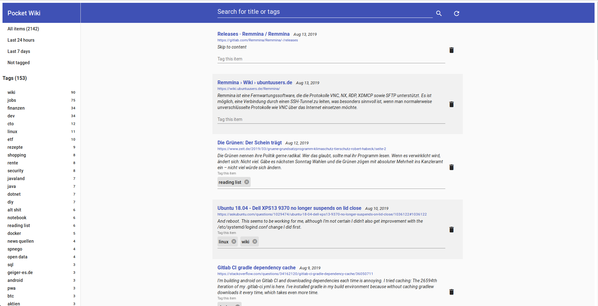

# pocket-wiki
Alternative User Interface for getpocket.com, alpha stage

## Features
* Synchronises all items from getpocket.com and saves them in the browsers LocalStorage
* Show items based on various criteria, like untagged, items from last 24 hours, items from last 7 days
* Search all saved items and tags - fast
* Quickly edit tags and items
* Show number of items for each tag
